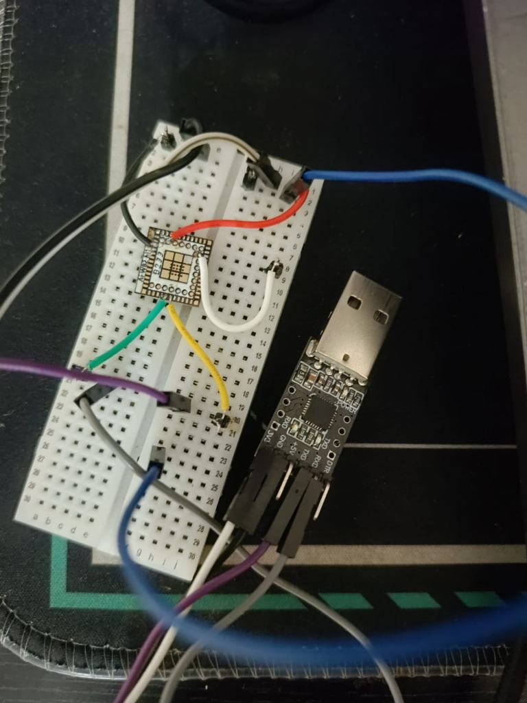
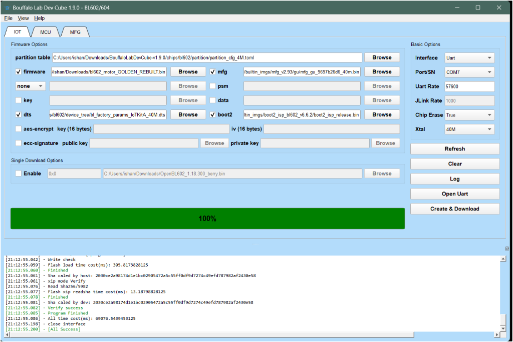

# BL602 Arduino Core

> A hardware-tested Arduino-style runtime for the Bouffalo Lab BL602, built on top of the native Bouffalo SDK.

---

## Hardware Used


| | |
|---|---|
| **Target chip** | Bouffalo Lab BL602C40 |
| **Module** | Ai-Thinker Ai-WB2 style module |
| **Architecture** | RISC-V RV32IMFC — single-core, 160 MHz, hardware FPU |
| **Wireless** | 2.4 GHz WiFi + Bluetooth LE |
| **Memory** | 276 KB SRAM, 2 MB Flash |
| **Crystal** | 40 MHz |

---

## Why this project exists

I could get the BL602 working reliably with the native Bouffalo SDK, but that workflow was not the development experience I wanted. So I built the Arduino-style layer I wanted to use.

This project grew out of roughly 20+ days of hands-on experimentation — building the native SDK environment, debugging UART framing, integrating an Arduino runtime, testing GPIO, bringing up native WiFi, investigating BLE, isolating coexistence problems, repeatedly flashing real hardware, and documenting which pieces actually work and which do not.

### The short version

I was already using low-cost ESP32-class hardware for compact embedded projects. The ESP32-C3 is especially attractive in this price range — it is cheap, single-core RISC-V, has WiFi and BLE, and has a mature ecosystem around Arduino and ESP-IDF.

But I kept running into a limitation for some of my projects: **the ESP32-C3 does not have hardware floating-point support.**

That made me interested in finding a cheap MCU with a similar feature set but with an FPU. I eventually came across a very inexpensive module that initially looked like another small WiFi/Bluetooth MCU. When I actually received it, I discovered it was a **Bouffalo Lab BL602C40**.

The BL602 combines:

- Single-core RISC-V with **hardware floating-point**
- 2.4 GHz WiFi
- Bluetooth LE
- Very low-cost hardware

For some of my compact embedded projects, that combination is better suited than the ESP32-C3 — not universally better, but better for the specific cases where I need an FPU, wireless, and a low bill of materials.

### Hardware was not the difficult part. The software ecosystem was.

The BL602 ecosystem is emerging and community-driven. There is real prior work — PINE64's Arduino efforts, community PlatformIO integrations, alternative SDK and toolchain approaches, and the native Bouffalo SDK itself. I tried the existing approaches available to me, but I could not get a reliable end-to-end workflow running on my actual BL602C40 hardware.

To be clear: I am not saying those projects do not work for anyone. They did not give me a reliable workflow on my hardware and setup.

What consistently worked was:

- **Ubuntu / WSL** as the build environment
- **Bouffalo Lab native SDK** with FreeRTOS
- **Bouffalo Lab DevCube 1.9.0** for flashing

That environment could produce real working firmware on my BL602C40 board. But the native SDK workflow was much less convenient than Arduino or PlatformIO. I wanted the Arduino `setup()` / `loop()` programming model without throwing away the native Bouffalo runtime that was actually working on my hardware.

So I built one.

---

## Architecture

The core idea: keep the native Bouffalo environment underneath. Do not replace the native WiFi/BLE stack with fake Arduino wrappers. Instead, run the Arduino programming model as a FreeRTOS task on top of the native runtime.

```
┌─────────────────────────────┐
│      Your Arduino Sketch    │
│      setup()  /  loop()     │
├─────────────────────────────┤
│    Arduino Runtime Layer    │
│  Serial, GPIO, Print, Time  │
├─────────────────────────────┤
│     FreeRTOS Task System    │
├─────────────────────────────┤
│   Native Bouffalo Lab SDK   │
│   WiFi · BLE · HAL · LWIP  │
└─────────────────────────────┘
```

This is why the project is an **Arduino-style runtime/core** rather than a project that pretends every Arduino peripheral API is already complete. The native SDK does the heavy lifting for WiFi and BLE. The Arduino layer gives you `setup()`, `loop()`, `Serial`, `digitalWrite`, `delay`, and the programming model you already know.

---

## The 2-Mbaud UART Trap

> **If you are working with a BL602 and getting garbage on your serial terminal, read this section first.**

The native BL602 SDK initializes the console UART at approximately **2,000,000 baud**. Most common USB-TTL adapters either cannot sustain that rate reliably or produce framing errors at that speed.

On my setup, the serial output was unreadable at 2 Mbaud. After considerable debugging, the fix was straightforward:

```c
bl_uart_init(0, 16, 7, 255, 255, 115200);
```

This reconfigures UART0 as:

| Parameter | Value |
|---|---|
| UART ID | 0 |
| TX | GPIO16 |
| RX | GPIO7 |
| Baud rate | **115200** |

After applying this:

- Serial output became readable
- The native WiFi stack continued working normally
- Arduino runtime `Serial.println()` output became readable

This was discovered through physical hardware debugging — not theoretical analysis. If you are bringing up a BL602 board and your serial monitor shows garbage, **check the baud rate first**.



---

## Feature Status

> **"Implemented" does not mean "physically verified."** This project makes an explicit distinction between code that exists and code that has been tested on real hardware.

| Label | Meaning |
|---|---|
| ✅ Physically verified | Tested on real BL602 hardware, serial output observed |
| ⚠️ Experimental | Code exists, not yet physically validated |
| ❌ Not implemented | No code or no verification path |

### Current status

| Feature | Status | Evidence |
|---|---|---|
| Arduino `setup()` / `loop()` | ✅ Physically verified | FreeRTOS task on real BL602 |
| `Serial` @ 115200 | ✅ Physically verified | UART0 on GPIO16/7 |
| GPIO digital I/O | ✅ Physically verified | Selected pins |
| `delay()` / `millis()` / `micros()` | ✅ Physically verified | Real firmware timing |
| `Print` / `String` | ✅ Physically verified | Real serial output |
| Native SDK WiFi AP + HTTP | ✅ Physically verified | Real BL602 AP with HTTP server |
| Native BLE advertising | ✅ Physically verified | Detected by nRF Connect |
| Wire / I2C | ⚠️ Experimental | Implemented, not physically verified |
| Arduino WiFi API | ⚠️ Experimental / Unverified | Not part of the stable path |
| Arduino BLE API | ❌ Not supported | Native BLE only |
| WiFi + BLE coexistence | ⚠️ Unverified | Combined runtime not proven |
| Arduino IDE direct compile/upload | ❌ Unverified | Native SDK build currently required |
| SPI | ❌ Not implemented / verified | |
| ADC / PWM | ❌ Not implemented | |
| BL604 hardware | ⚠️ Not physically verified | BL602 is the primary target |

---

## Hardware Verification

### WiFi

The native Bouffalo WiFi stack runs as a background FreeRTOS task alongside the Arduino runtime. The firmware creates a WiFi access point (`BL602-Arduino`) and serves HTTP responses — all while the Arduino `loop()` continues printing `ARDUINO ALIVE` to serial.

The serial monitor below shows real WiFi stack traffic interleaved with the Arduino runtime output at 115200 baud:


### BLE

Native BLE advertising was tested separately using the Bouffalo SDK BLE stack. The device advertises as `BL602-SDK-BLE` and was detected and connected to using nRF Connect on a real phone.


> **Note:** WiFi and BLE have each been proven to work independently. Combined WiFi + BLE coexistence has not been validated in a single firmware image.

---

## Development Workflow

### Flashing

The verified flashing tool is **Bouffalo Lab DevCube 1.9.0**. The screenshot below shows a successful flash to the BL602 over UART (COM7, 40 MHz crystal, chip erase enabled, 100% progress, `[All Success]`):



### Getting Started (verified workflow)

The current known-good workflow is:

1. **Build environment:** Ubuntu or WSL
2. **SDK:** Clone and set up the Bouffalo Lab native SDK
3. **Build:** Compile using the native SDK build system (`make`)
4. **Flash:** Use Bouffalo Lab DevCube 1.9.0 over UART
5. **Monitor:** Open a serial terminal at **115200 baud** on the UART0 pins (GPIO16 TX, GPIO7 RX)

> **Important:** Arduino IDE Boards Manager installation has not been validated end-to-end. The `boards.txt`, `platform.txt`, and `package_bl602_index.json` files exist in this repository as scaffolding for future Arduino IDE integration, but the verified path today is the native SDK build.

See [docs/building-from-source.md](docs/building-from-source.md) for detailed build instructions.

### Pin Mapping

Pin numbers map directly to BL602 GPIO numbers — no remapping.

| Function | GPIO | Notes |
|---|---|---|
| Serial TX | 16 | UART0 |
| Serial RX | 7 | UART0 |
| LED_BUILTIN | 1 | Board-dependent |
| I2C SDA | 4 | Experimental / unverified |
| I2C SCL | 3 | Experimental / unverified |

---

## Why BL602 instead of ESP32-C3?

This is not a performance benchmark. It is a summary of why the BL602 was more interesting to me for certain projects.

| | ESP32-C3 | BL602 |
|---|---|---|
| Architecture | Single-core RISC-V | Single-core RISC-V |
| Hardware FPU | **No** | **Yes** |
| WiFi | Yes | Yes |
| BLE | Yes | Yes |
| Ecosystem | Mature (Arduino, ESP-IDF) | Emerging / Community-driven |
| My reason for interest | Mature, easy workflow | Low cost + FPU + wireless |

The ESP32-C3 remains the safer, easier choice for most projects. The BL602 is interesting when you specifically need hardware floating-point at a very low price point and are willing to work with a less mature toolchain.

---

## Prior Art

I am not claiming to be the first person to bring Arduino concepts to the BL602. Notable prior and related work includes:

- [**PINE64 ArduinoCore-bouffalo**](https://github.com/pine64/ArduinoCore-bouffalo) — PINE64's Arduino core effort for BL602/BL706
- **Community PlatformIO integrations** for Bouffalo chips
- **Bouffalo Lab native SDK** — the foundation this project builds on
- Various community BL602 Arduino and toolchain experiments

I built this project because I needed a workflow that actually worked on my hardware. The existing approaches did not give me a reliable end-to-end path on my specific BL602C40 module, so I started from the native SDK — which did work — and built the Arduino layer on top.

---

## Known Limitations

- **Arduino IDE direct compile/upload** is not yet validated — native SDK build is required
- **Arduino WiFi API** is experimental and not stable — use native SDK WiFi calls instead
- **Arduino BLE API** is not supported — BLE works only through the native SDK
- **WiFi + BLE coexistence** has not been verified in a combined firmware
- **Wire / I2C** is implemented but not physically tested on hardware
- **SPI** is not implemented or verified
- **ADC / PWM** are not implemented
- **BL604** hardware has not been physically validated (BL602 is the tested target)

---

## Roadmap

No dates promised. Ordered by priority:

1. Arduino IDE build and package support (Boards Manager integration)
2. Physical Wire / I2C validation on real hardware
3. Arduino WiFi API stabilization
4. Arduino BLE API
5. WiFi + BLE coexistence testing
6. Broader board and variant testing
7. BL604 hardware validation
8. PlatformIO support

---

## Repository Structure

```
BL602-Arduino-Core/
├── cores/bl602/           # Arduino core implementation
│   ├── Arduino.h          # Main Arduino header
│   ├── main.c             # FreeRTOS entry + Arduino task
│   ├── wiring_digital.c   # pinMode, digitalWrite, digitalRead
│   ├── wiring_time.c      # delay, millis, micros, yield
│   ├── HardwareSerial.*   # UART serial (115200 on GPIO16/7)
│   ├── Print.*             # Print class
│   ├── WString.*           # String class
│   └── ...
├── libraries/
│   ├── WiFi/              # Arduino WiFi API (experimental)
│   ├── Wire/              # I2C (experimental)
│   └── SPI/               # SPI (not verified)
├── variants/bl602c40/     # Board-specific pin definitions
├── examples/              # Example sketches
├── experimental/          # Experimental / unverified code
├── docs/                  # Documentation and images
├── boards.txt             # Arduino board definitions
├── platform.txt           # Arduino platform configuration
└── package_bl602_index.json  # Boards Manager index (future)
```

---

## Example

```cpp
#include <Arduino.h>
#include <HardwareSerial.h>

void setup() {
    Serial.begin(115200);
    Serial.println("Hello from BL602!");
    pinMode(LED_BUILTIN, OUTPUT);
}

void loop() {
    digitalWrite(LED_BUILTIN, HIGH);
    delay(500);
    digitalWrite(LED_BUILTIN, LOW);
    delay(500);
    Serial.println("ARDUINO ALIVE");
}
```

---

## License

MIT License. See [LICENSE](LICENSE).

---

## Contributing

See [CONTRIBUTING.md](CONTRIBUTING.md).

Issues and pull requests are welcome — especially hardware test reports from other BL602 boards and modules.
