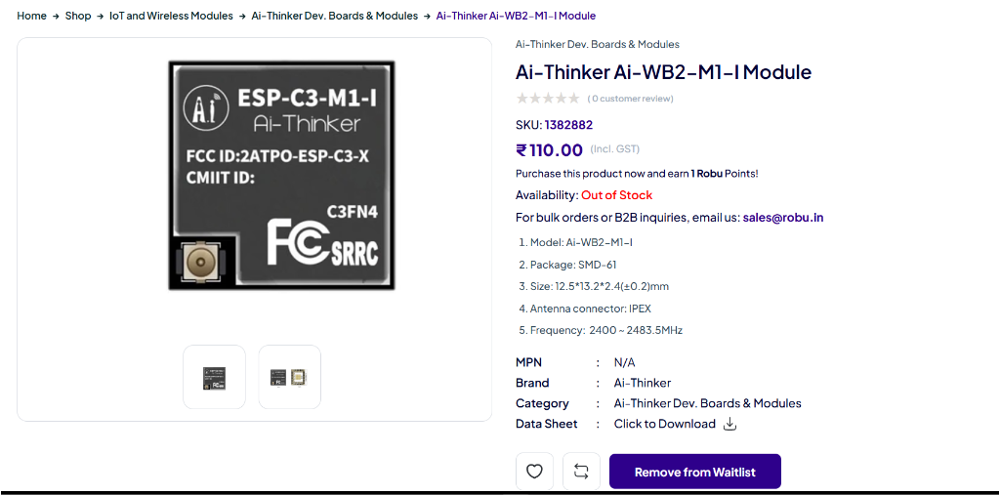
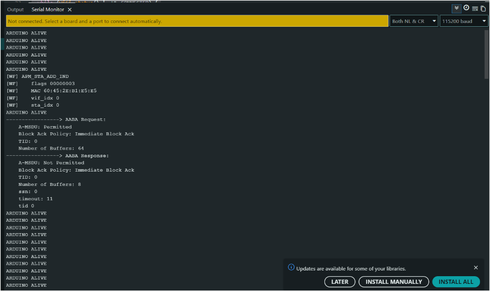
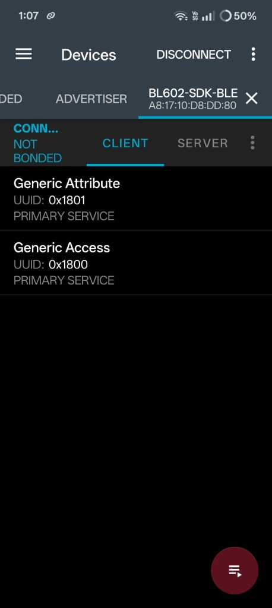

# BL602 Arduino Core

> An Arduino-compatible development workflow for Bouffalo Lab BL602, built on the native Bouffalo SDK and physically validated on real BL602C40 hardware.


*Figure 1: Arduino IDE 2.3.10 uploading a BL602 sketch through the public Boards Manager package. Flash verification completed with `[All Success]` on real BL602C40 hardware.*

> **Verified path**: Arduino IDE 2.3.10 -> Boards Manager -> compile -> `bflb_iot_tool` -> BL602C40 flash -> SHA-256 verification -> successful boot.

[](https://github.com/Ishu1519/BL602-Arduino-Core/releases/latest)
[](LICENSE)
[](https://www.arduino.cc/en/software)
[](https://riscv.org/)
[](https://www.bouffalolab.com/)

---

## Install with Arduino Boards Manager

Validated with **Arduino IDE 2.3.10** and **Arduino CLI**. You can install the BL602 core directly using the public package index URL:

```text
https://raw.githubusercontent.com/Ishu1519/BL602-Arduino-Core/main/package_bl602_index.json
```

### Installation Steps

1. Open **Arduino IDE** -> **File** -> **Preferences** (or `Cmd + ,` on macOS).
2. Paste the URL above into **Additional Boards Manager URLs**.
3. Open **Boards Manager** (left sidebar icon or **Tools** -> **Board** -> **Boards Manager...**).
4. Search for `BL602`.
5. Click **Install** on **BL602 Boards** by *Ishu1519* (tested release: **`v0.1.0-alpha.3`**).
6. Select **Tools** -> **Board** -> **BL602 Boards** -> **Bouffalo Lab BL602**.

---

## Why This Project Exists

The Espressif ESP32-C3 is an inexpensive, popular RISC-V microcontroller backed by a mature software ecosystem. During hardware experimentation, the Bouffalo Lab BL602 stood out as an intriguing alternative: it delivers a 32-bit RISC-V core running up to 192 MHz, hardware single-precision floating-point (FPU), 276 KB SRAM, and integrated 2.4 GHz Wi-Fi 4 / BLE 5.0 at an extremely low price point.

```
ESP32-C3 remains the easier and more mature choice for most commercial projects.
This project exists because I wanted to see how far I could push the cheaper BL602
platform once the underlying software and tooling ecosystem challenges were addressed.
```

The challenge with BL602 was never the silicon--it was finding a reproducible development workflow that reliably built, flashed, verified, and executed on physical hardware.

When testing existing community Arduino and PlatformIO implementations on my Ai-Thinker BL602C40 (Ai-WB2-M1-I) module, I ran into broken tool dependencies, silent boot failures, flash loader compatibility errors, and baud rate mismatches. The native Bouffalo SDK (`bl_iot_sdk`) under Linux/WSL paired with BouffaloLab DevCube was the first environment that reliably worked.

Once the native environment was verified, I set out to build an Arduino-compatible layer directly on top of the working native SDK architecture so developers could program the BL602 with standard Arduino semantics (`setup()`, `loop()`, `pinMode()`, `digitalWrite()`, `Serial`).

### BL602 Architectural Overview

| Feature | Specification | Why It Interested Me |
| :--- | :--- | :--- |
| **Core Architecture** | 32-bit RISC-V (RV32IMAFCP) @ 192 MHz | High-efficiency open ISA with DSP & Bitmanip extensions |
| **FPU** | Single-Precision IEEE 754 Hardware FPU | Accelerated math compared to soft-float MCUs |
| **Memory** | 276 KB SRAM + 128 KB ROM | Generous RAM for FreeRTOS tasks and network buffers |
| **Storage** | 4 MB (32 Mbit) Quad-SPI NOR Flash | 4 MB (32 Mbit) SPI NOR flash on the Ai-WB2-M1-I module |
| **Wireless** | 2.4 GHz Wi-Fi 802.11 b/g/n + BLE 5.0 | Integrated wireless combo with coexistence support |
| **Cost** | Sub-$2 module availability | High performance-to-cost ratio for IoT endpoints |

---

## Prior Art and Existing Work

This project is not the first attempt to bring Arduino to the BL602:

* **[PINE64 ArduinoCore-bouffalo](https://github.com/pine64/ArduinoCore-bouffalo)**: PINE64 created an early Bouffalo Arduino core for the PineCone board, which is now marked as deprecated.
* **[Community PlatformIO BL602 Arduino Integration](https://github.com/Community-BL-IOT/pio-bl602-boufallo-arduino-test)**: Valuable community effort demonstrating custom PlatformIO builder scripts for Bouffalo chips.

### Differentiation of This Core

Rather than attempting to reinvent the SDK or maintain an unmaintained fork, this project focuses on a **reproducible, end-to-end verified Arduino package**:
* Integrates cleanly with the native Bouffalo SDK startup sequence and FreeRTOS scheduler.
* Packages native RISC-V toolchains and upload tools via standard Arduino Boards Manager JSON specifications.
* Provides full physical validation across every stage: compilation -> UART handshake -> SPI flash identification -> partition programming -> SHA-256 verification -> physical chip boot -> Serial @ 115200 -> GPIO square-wave toggling.

---

## What Actually Had to Be Solved

Building a functioning Arduino package for BL602 required diagnosing several non-obvious embedded systems hurdles:

```
+-----------------------------------------------------------------------------------+
|                            CORE TECHNICAL CHALLENGES                              |
+------------------------+----------------------------------------------------------+
| 1. Startup Integration | SDK bfl_main() owns hardware; Arduino runs in FreeRTOS.  |
| 2. UART Baud Mismatch  | Reconfigured 2 Mbaud default console to standard 115200.  |
| 3. Toolchain Packaging | Automated Xuantie GCC + bflb_iot_tool Arduino tool specs.|
| 4. Flash 003D Error    | Upgraded eflash loader to v2.5.1 & bundled flash tables. |
+------------------------+----------------------------------------------------------+
```

### 1. Native SDK Startup Architecture

Early Arduino integration attempts replaced the native SDK entrypoint (`bfl_main()`) with a custom `main()`. This caused critical hardware and OS initialization to be skipped:
* RISC-V trap handlers and vector tables were unconfigured (`bl_sys_early_init()`).
* FreeRTOS heap memory regions were never defined (`vPortDefineHeapRegions()`).
* Board clock trees (40 MHz crystal oscillator) and power domains were uninitialized.

**The Solution**: The Arduino core preserves the native Bouffalo SDK startup sequence (`start.S` -> `bfl_main()`). The FreeRTOS scheduler is started by the SDK, and the Arduino runtime is spawned as a dedicated FreeRTOS task (`arduino_task`, stack: 2048 words, priority: 5) from the SDK's application entry hook (`main()`):

```
Physical Reset
  |
  v
start.S (RISC-V Vector / Trap Setup)
  |
  v
bfl_main() (Clocks, Heap, System Init)
  |
  v
vTaskStartScheduler() (FreeRTOS Active)
  |
  v
app_main_entry() ---> main() [cores/bl602/main.cpp]
                      |
                      v
               xTaskCreate("arduino_task", stack: 2048, priority: 5)
                      |
                      |---> setup()
                      `---> loop() (with vTaskDelay yield)
```

### 2. The 2-Mbaud UART Trap

The default Bouffalo SDK initializes UART0 to **2,000,000 baud** (2 Mbaud). Most common USB-to-TTL bridge ICs (e.g. standard CP2102, CH340G, FTDI) encounter clock-divisor sampling errors at 2 Mbaud, producing unreadable framing garbage in standard serial monitors.

**The Solution**: In `cores/bl602/main.cpp`, UART0 is explicitly reinitialized to standard **115,200 baud (8-N-1)**:
* **TX Pin**: `GPIO 16`
* **RX Pin**: `GPIO 7`
* **Baud Rate**: `115200`

*(See [docs/uart-baud.md](docs/uart-baud.md) for full diagnostic logs and terminal configuration).*

### 3. Toolchain & Boards Manager Integration

To eliminate manual tool configuration, the core builds on:
* **RISC-V GCC**: `Xuantie-900-gcc` (`riscv64-unknown-elf-gcc`, RV32IMAFCP, ABI: `ilp32f`).
* **Upload Utility**: `bflb_iot_tool` (Bouffalo Lab flashing utility packaged for Windows, Linux x86_64, and macOS).
* **Package Index**: Automated tool resolution via `package_bl602_index.json`.

### 4. BL602 Flash Tool Debugging & Resolution

During initial automated upload tests, `bflb_iot_tool` consistently failed during SPI flash identification with:

```text
readdata: b'c8401680'
{"ErrorCode": "003D", "ErrorMsg": "BFLB FLASH MATCH TYPE FAIL"}
```

**The Diagnosis**:
* The physical SoC returned JEDEC ID `0xC8 0x40 0x16 0x80` (**GigaDevice GD25Q32C/E 4MB SPI NOR flash**).
* The older `eflash_loader_v2.4.2` helper binary running in SRAM had an incomplete on-chip lookup table.
* The tool archive lacked the vendor `utils/flash/bl602/` parameter profile database.

**The Solution**:
* Upgraded the helper binary to `eflash_loader_v2.5.1` (from DevCube v1.9.0).
* Bundled the `utils/flash/bl602/` directory containing the BL602 flash parameter database, including `GD25Q32C_c84016.conf` and `flashcfg_list.csv`.
* Corrected argument formatting in `platform.txt` (`"--firmware=..."`).

*(See [docs/flash-tool-debugging.md](docs/flash-tool-debugging.md) for detailed trace logs and register maps).*

---

## Architecture & Workflow

### Layered Software Architecture


### End-to-End Development & Upload Pipeline


---

## Hardware Setup

Physical validation was performed on the **Ai-Thinker BL602C40 / Ai-WB2-M1-I** development board:


*Figure 2: Ai-Thinker BL602C40 (Ai-WB2-M1-I) module wired to USB-to-TTL UART adapter for physical validation.*

### Pin Connections

| Signal | BL602 Pin | USB-TTL Adapter | Function / Notes |
| :--- | :---: | :---: | :--- |
| **TXD** | `GPIO 16` | **RXD** | UART0 Serial Transmit (115200 baud) |
| **RXD** | `GPIO 7` | **TXD** | UART0 Serial Receive (115200 baud) |
| **GND** | `GND` | **GND** | Common Ground |
| **3V3** | `3V3` | **3V3** | 3.3V Power Supply (ensure >= 300mA capacity) |
| **BOOT** | `GPIO 8` | *Button / Jumper* | Pull HIGH (3.3V) during reset for flashing |
| **TEST** | `GPIO 1` | *External LED / Meter* | Verified physical GPIO output pin |

---

## Physical Verification Evidence

### 1. Arduino IDE Flashing & On-Chip Hash Verification

```text
"C:\Users\...\packages\BL602\tools\bflb_iot_tool\1.8.6/bflb_iot_tool.exe" --chipname=bl602 --interface=uart --port=COM7 --baudrate=115200 "--firmware=.../test_sketch.ino.bin"
[02:27:38.571] - Version: eflash_loader_v2.5.1
[02:27:40.448] - shake hand success
[02:27:40.465] - ========= chipid: a81710d8dd7f =========
[02:27:41.888] - macaddr: 7fddd81017a8
[02:27:41.892] - flash jedec id: c8401680
[02:27:41.897] - get flash size: 0x00400000 (4 MB)
[02:27:41.897] - ========= programming chips\bl602\partition\partition.bin to 0x0000E000
[02:27:42.030] - Sha caled by host: fd6af18fc4aaf2807277cac767ca19d12af7b55f5ecbb8902ef28bc2430524aa
[02:27:42.040] - Sha caled by dev:  fd6af18fc4aaf2807277cac767ca19d12af7b55f5ecbb8902ef28bc2430524aa
[02:27:42.040] - Verify success
[02:27:42.044] - ========= programming chips\bl602\partition\partition.bin to 0x0000F000
[02:27:42.165] - Verify success
[02:27:42.169] - Program Finished
[02:27:42.272] - [All Success]
```

### 2. Serial Runtime Output

Connecting a serial terminal to `COM7` at **115,200 baud (8-N-1)** after physical reset:

```text
ARDUINO CLI BL602 BOOT OK
ARDUINO CLI ALIVE
ARDUINO CLI ALIVE
ARDUINO CLI ALIVE
```

### 3. Native Wi-Fi & BLE Validation

*(Note: The Wi-Fi and BLE captures below demonstrate the underlying Bouffalo SDK wireless subsystem functionality on this hardware. Arduino-level Wi-Fi and BLE wrapper APIs remain experimental / in development).*

| Native Wi-Fi AP & HTTP Server | Native BLE 5.0 Advertising |
| :---: | :---: |
|  |  |
| *Bouffalo SDK HTTP server serving clients at `192.168.169.1`* | *Nordic nRF Connect discovering BL602 BLE beacon* |

---

## Feature Status

| Feature / Subsystem | Status | Evidence / Notes |
| :--- | :---: | :--- |
| **Arduino `setup()` / `loop()`** | VERIFIED | Dispatches within dedicated FreeRTOS `arduino_task` |
| **`Serial` UART @ 115200** | VERIFIED | `Serial.print()` / `println()` running over UART0 (TX=16, RX=7) |
| **`pinMode()` / `digitalWrite()`** | VERIFIED | Tested on GPIO 1 (3.3V / 0V toggling measured physically) |
| **`delay()` / `millis()` / `micros()`** | VERIFIED | FreeRTOS-backed non-blocking scheduling and timer registers |
| **Arduino CLI Compilation** | VERIFIED | Automated compilation using `Xuantie-900-gcc` |
| **Arduino IDE 2.3.10 Compilation** | VERIFIED | Clean build with static link against `libbl602.a` |
| **Arduino IDE 2.3.10 Upload** | VERIFIED | Automated flashing & SHA-256 verification via `bflb_iot_tool` |
| **Boards Manager Packaging** | VERIFIED | Clean install from public GitHub raw index |
| **Native Wi-Fi AP & HTTP Server** | VERIFIED | Validated in native SDK (`192.168.169.1`) |
| **Native BLE 5.0 Advertising** | VERIFIED | Validated in native SDK (discovered via nRF Connect) |
| **Wire (I2C)** | EXPERIMENTAL | Driver implemented in core; physical bus verification in progress |
| **Arduino Wi-Fi API (`WiFi.h`)** | EXPERIMENTAL | Basic wrapper available; async socket integration in progress |
| **Arduino BLE API** | NOT IMPLEMENTED | Native BLE works; Arduino wrapper not yet created |
| **Wi-Fi + BLE Coexistence** | EXPERIMENTAL | Supported by SDK; coexistence profile validation in progress |
| **Analog I/O (ADC) / PWM** | NOT IMPLEMENTED | Under development for future release |
| **BL604 SoC Variant** | UNVALIDATED | Silicon share core architecture; pin breakouts unverified |

---

## Engineering Highlights

* **Preserved Native Startup Pipeline**: Retained native Bouffalo SDK hardware setup, vector tables, and clock trees, running Arduino as a standard FreeRTOS application task.
* **Eliminated UART Baud Trap**: Reconfigured early 2 Mbaud console output to standard 115,200 baud, enabling instant compatibility with standard USB-TTL adapters and Arduino serial monitors.
* **Diagnosed SPI Flash Identification Failure**: Traced error `003D: BFLB FLASH MATCH TYPE FAIL` to loader lookup limitations, resolved by upgrading to `eflash_loader_v2.5.1` and bundling the vendor flash profile database.
* **Turnkey Boards Manager Experience**: Packages the compiler and upload toolchains for Windows, Linux, and macOS with published SHA-256 checksums.
* **Hardware Grounded**: Avoided simulated or speculative fixes by verifying every build against physical BL602C40 hardware.

---

## Getting Started

### Minimal Verified Example

> **Hardware Note**: The Ai-Thinker Ai-WB2-M1-I module does not feature an onboard user LED. Connect an external LED with a current-limiting resistor between **GPIO 1** and **GND** for visual verification.

```cpp
/*
 * BL602 Verified Blink & Serial Test
 * Target: Bouffalo Lab BL602 / Ai-WB2-M1-I
 * Serial Output: 115200 baud (8-N-1) on GPIO16 (TX) / GPIO7 (RX)
 * Test Pin: GPIO1
 */

const int TEST_PIN = 1;

void setup() {
    // Initialize serial communication at 115200 baud
    Serial.begin(115200);
    Serial.println("ARDUINO CLI BL602 BOOT OK");

    // Configure test GPIO
    pinMode(TEST_PIN, OUTPUT);
}

void loop() {
    Serial.println("ARDUINO CLI ALIVE");

    // Toggle GPIO HIGH (3.3V)
    digitalWrite(TEST_PIN, HIGH);
    delay(500);

    // Toggle GPIO LOW (0.0V)
    digitalWrite(TEST_PIN, LOW);
    delay(500);
}
```

### Flashing Instructions

1. Connect your USB-to-TTL adapter to the BL602 (`TX` -> `GPIO7`, `RX` -> `GPIO16`, `GND`, `3V3`).
2. Hold the **BOOT** button (pull `GPIO8` HIGH), press and release the **RESET** button, then release **BOOT** to enter UART bootloader mode.
3. In Arduino IDE, click **Upload** (or run `arduino-cli upload -p COMx --fqbn BL602:bl602:bl602 sketch`).
4. Once upload reports `[All Success]`, press the **RESET** button on the board.
5. Open the **Serial Monitor** at **115200 baud** to view real-time output.

---

## Known Limitations & Roadmap

### Known Limitations

* **Alpha Release (`v0.1.0-alpha.3`)**: Core APIs are functional for standard digital I/O, UART serial, and timing.
* **Arduino Wi-Fi Wrapper**: Native Wi-Fi works in SDK; high-level Arduino `WiFi.h` class is experimental.
* **Arduino BLE Wrapper**: Native BLE advertising works; Arduino BLE library is not yet implemented.
* **No Analog / PWM**: ADC and hardware PWM drivers are currently in development.
* **Manual Bootloader Entry**: Boards without auto-reset circuitry require manual BOOT + RESET button sequencing.

### Development Roadmap

- [x] Native Bouffalo SDK startup & FreeRTOS task integration
- [x] Automated Arduino Boards Manager package index (`package_bl602_index.json`)
- [x] Auto-resolving RISC-V GCC & `bflb_iot_tool` dependencies
- [x] UART0 115200 baud serial communication (`HardwareSerial`)
- [x] Standard digital I/O (`pinMode`, `digitalWrite`, `digitalRead`)
- [x] Microsecond and millisecond timers (`delay`, `millis`, `micros`)
- [ ] Stabilize Wire (I2C) master driver
- [ ] Implement Hardware SPI master driver
- [ ] Complete Arduino `WiFi` client and server wrappers
- [ ] Implement Arduino `BLE` peripheral wrapper
- [ ] Add ADC analogRead() and PWM analogWrite() support
- [ ] Validate BL604 packaging and pin definitions

---

## Project Documentation

* [Getting Started Guide](docs/getting-started.md)
* [Building from Source with Native SDK](docs/building-from-source.md)
* [Pin Mapping & Hardware Reference](docs/pin-mapping.md)
* [Troubleshooting Guide](docs/troubleshooting.md)
* [UART Baud Rate Diagnosis](docs/uart-baud.md)
* [SPI Flash Tool Debugging](docs/flash-tool-debugging.md)

---

## Repository Structure

```
BL602-Arduino-Core/
|-- cores/
|   `-- bl602/                 # Arduino core implementation (main, Serial, digital, time)
|-- variants/
|   `-- bl602c40/              # Board variant pin mappings (pins_arduino.h)
|-- system/
|   |-- include/               # Bouffalo SDK header files
|   |-- ld/                    # Flash linker scripts (flash_rom.ld)
|   `-- lib/                   # Precompiled SDK static libraries (FreeRTOS, HAL, Wi-Fi, BLE)
|-- libraries/                 # Bundled libraries (Wire, SPI, WiFi wrappers)
|-- examples/                  # Verified Arduino sketch examples
|-- docs/                      # Technical documentation, schematics, and diagrams
|   `-- images/                # Architecture diagrams and verification captures
|-- package_bl602_index.json   # Arduino Boards Manager package definition
|-- platform.txt               # Arduino compile & upload recipes
|-- boards.txt                 # Board target configurations
|-- LICENSE                    # MIT License
`-- THIRD_PARTY_NOTICES.md     # Third-party attribution (Bouffalo SDK, FreeRTOS, lwIP)
```

---

## License & Attribution

* This project is licensed under the **MIT License** - see the [LICENSE](LICENSE) file for details.
* Incorporates components from the **Bouffalo Lab BL602 SDK** (Apache-2.0 / BSD-3-Clause).
* FreeRTOS is licensed under the **MIT License**.
* lwIP is licensed under the **BSD-3-Clause License**.
* See [THIRD_PARTY_NOTICES.md](THIRD_PARTY_NOTICES.md) for full licensing information.
